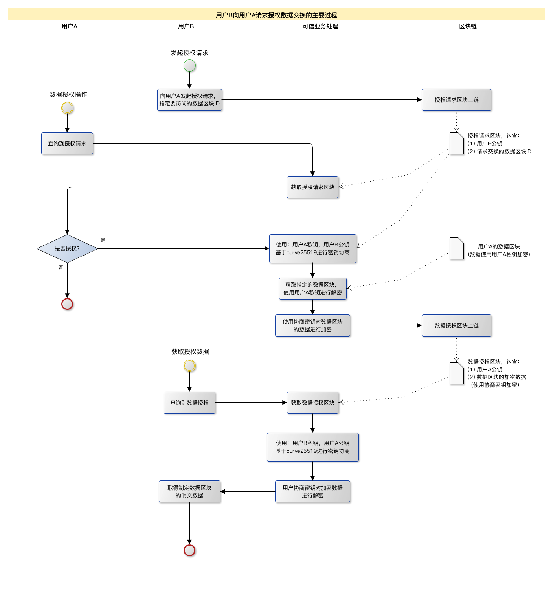

## 在区块链上进行授权数据交换


### 1. 概述

​		区块链具有分布式、去中心化、防篡改等特性。由于区块链构建的特性，每个节点都存储有全部的区块数据，理论上用户可以查看到所有的区块数据。当使用区块链对敏感数据进行数据存储和数据交换时，需要对用户查看数据的权限进行验证和授权，用户只能查看被授权的数据。同时，因为区块链特有的放篡改性质，将授权请求和数据授权的过程记录在区块链上，可以实现对用户请求授权、授权操作、数据查询等操作的留痕和追溯。因此，如何在区块链上构建数据授权和交换的方法是具体应用区块链时必不可少的需求。

​		Ed25519是一个数字签名算法，安全性极高，等价于RSA约3000-bit。签名过程不依赖随机数生成器，不依赖hash函数的防碰撞性，没有时间通道攻击的问题，并且签名很小，只有64字节，公钥只有32字节。Curve25519是一个椭圆曲线，提供128位安全性，用于椭圆曲线Diffie-Hellman（ECDH）密钥协商方案。它是最快的ECC曲线之一，并未被任何已知专利所涵盖。

​		因此，在本次实现中，使用Tendermint作为区块链共识引擎实现轻量化区块链应用，便于维护。去中心化、分布式存储链上信息；使用LevelDB嵌入式数据库存储链表索引数据；使用Curve25519算法进行密钥协商和数据加密。以授权数据交换为场景，实现了：（1）用户数据链上存储，实现防篡改和可追溯；（2）使用Ed25519非对称密钥作为用户密钥进行用户识别；（3）使用Curve25519进行密钥协商；（4）节点分布式去中心化部署，允许1/3节点故障仍可以正常工作。


### 2. 设计概要

#### 2.1 主要功能

1. 链上存储数据，数据实体为字节流，交易数据内容由应用确定，不做限制
3. 交易数据、授权数据全部上链
4. 以用户区分交易数据所有权，用户提交的数据对自己是开放的
5. 交易数据使用用户密钥加密存储，其他用户需要通过请求授权和被授权才能解密查看
6. 交易节点提供功能：提交交易数据上链，提交授权请求，对授权请求进行授权，交易查询，查询授权请求，查询授权结果
7. 区块的类型：数据区块（存储交易数据）；授权区块（存储授权请求和授权结果）
8. 用户密钥使用Ed25519非对称密钥
9. 密钥交换过程使用Curve25519密钥协商机制


#### 2.2 授权数据交换的流程




### 3. 数据结构设计

####  3.1 用户密钥

> 使用ed25519非对称密钥，私钥长度64字节，公钥长度32字节。json密钥数据使用base64编码。

```json
{
	"sign_key":{
		"type":"ed25519/privkey",
		"value":"UgM13IPx/BkwfQo8jce6TMR5bRuAv7ZLdBooTZWm2ixLaNitCW91NHW06h8VQw=="
	},
	"CryptoPair":{
		"PrivKey":"tgNfUoYkh9xKs1hVKs+5uXNetCxvDRRHBNmLMs5/NKk=",
		"PubKey":"qyBsXnVKKjvFNxHBRudc3tCp8t8ymqBSF1Ga8qlfqFs="
	}
}
```


#### 3.2 区块交易数据结构

区块交易结构基类

```go
// Transx 事务基类
type Transx struct {
	Signature  []byte //发送方对这个消息的私钥签名
	SendTime   *time.Time
	SignPubKey []byte // 签名公钥
	Payload    IPayload
}
```

交易数据payload

```go
// 交易信息
type Deal struct {
	ID     uuid.UUID // 交易ID
	UserID []byte //用户的加密公钥
	Data   []byte // 加密交易数据（例如 ipfs hash）
}
```

授权请求/授权操作payload

```go
// 授权操作
// ToUserID 请求 FromUserID 授权，指定 DealID
// FromUserID 加密数据 Data 后 返回 ToUserID
type Auth struct {
	ID          uuid.UUID
	ReqID       uuid.UUID // 授权请求的ID， action==5时使用
	DealID      uuid.UUID // 相关交易ID
	FromUserID  []byte // 数据所有者的用户ID（用户公钥）
	ToUserID    []byte // 被授权的用户ID（用户公钥）
	Data        []byte //  action==4, rb.pub (33 bytes) + rb.priv (B的私钥加密的)
			           //  action==5, ra.pub (33 butes) + data (协商的密钥加密)
	Action      byte // 0x04 请求授权， 0x05 响应授权
}
```


#### 3.3 密钥交换和加密算法相关

1. 交易数据payload中```Data```使用curve25519加密，密钥为用户私钥

2. 响应授权payload中```Data```使用curve25519加密，密钥为协商密钥


### 4. 使用示例

#### 4.1 本地节点测试

编译

```shell
$ make build
```


初始化

```shell
$ build/xchain init --home n1
```


启动节点

```shell
$ build/xchain node --home n1 --consensus.create_empty_blocks=false
```

初始化用户密钥
```shell
$ build/xcli init --home users/user1
$ build/xcli init --home users/user2
$ cat users/user1/exchange.key 
{"sign_key":{"type":"ed25519/privkey","value":"UgM13IPx/BkwfQo8jceLq1CiXlT3lm4WLZ6K6TMR5bRueBGgTDVAv7ZLdBooTZWm2ixLaNitCW91NHW06h8VQw=="},"CryptoPair":{"PrivKey":"tgNfUoYkh9xKs1hVKs+5uXNetCxvDRRHBNmLMs5/NKk=","PubKey":"qyBsXnVKKjvFNxHBRudc3tCp8t8ymqBSF1Ga8qlfqFs="}}
$ cat users/user2/exchange.key 
{"sign_key":{"type":"ed25519/privkey","value":"bmjue9qM8cyNPWElwX/sTDPbwwxnqluB+Y80zaRoxWxSuGjn2S77wC7b7OL94vkz7TInxMBZfTZ1wz36NJ3X3g=="},"CryptoPair":{"PrivKey":"gix62BaGqjD3ktH8G3lHdIuTTku6o2fHkkrJ5kLbID4=","PubKey":"j9cIgmm17x0aLApf0i20UR7Pj34Ua/JwyWOuBGgYIFg="}}
```


#### 4.2 数据上链

##### user1 数据上链

> 返回值为区块id 

```shell
$ build/xcli deal --home users/user1 "hello world"
Deal ==> {"id":"ddd8c8c2-d625-46ad-ab6c-6c49aad45836"}
```


##### user1 查询链上数据

> 查询上述新添加的数据区块，因为user1是提交者，所以可以解密data数据，看到明文。

```shell
$ build/xcli queryTx --home users/user1 _ ddd8c8c2-d625-46ad-ab6c-6c49aad45836
Tx ==> {"data":"hello world","id":"ddd8c8c2-d625-46ad-ab6c-6c49aad45836","send_time":"2021-01-07T06:17:08.356336674Z","type":"DEAL","user_id":"qyBsXnVKKjvFNxHBRudc3tCp8t8ymqBSF1Ga8qlfqFs="}
```

> 下面是区块上的原始数据，```Data```字段是curve25519加密存储的，使用user1的私钥进行加密。

```json
{
    "Signature":"MEUCIQCyDuZfg6aUGbFdaonXC81GLynPwoXQkGUbaX6rhdW02AIgcGlDVAhH0hh86CcXo3zrntC+n2NDMFNHuXIFAkG2TN0=",
    "SendTime":"2021-01-07T06:17:08.356336674Z",
    "SignPubKey":{
        "type":"ed25519/pubkey",
        "value":"bngRoEw1QL+2S3QaKE2VptosS2jYrQlvdTR1tOofFUM="
    }
    "Payload":{
        "type":"deal",
        "value":{
            "ID":"3djIwtYlRq2rbGxJqtRYNg==",
            "UserID":"qyBsXnVKKjvFNxHBRudc3tCp8t8ymqBSF1Ga8qlfqFs=",
            "Data":"NMiY8YnJVX7UUhLHTTgzsg=="
        }
    }
}
```


##### user2 查询链上数据

> 因为此区块不是user2的，所以当user2查询时，只能看到加密数据，不能解密。

```shell
$ build/xcli queryTx --home users/user2 "qyBsXnVKKjvFNxHBRudc3tCp8t8ymqBSF1Ga8qlfqFs=" ddd8c8c2-d625-46ad-ab6c-6c49aad45836
Tx ==> {"data":"NMiY8YnJVX7UUhLHTTgzsg==","id":"ddd8c8c2-d625-46ad-ab6c-6c49aad45836","send_time":"2021-01-07T06:17:08.356336674Z","type":"DEAL","user_id":"qyBsXnVKKjvFNxHBRudc3tCp8t8ymqBSF1Ga8qlfqFs="}
```


#### 4.3 授权数据交换

##### user2 提出数据授权请求

> user2向user1发起请求，获取user1的数据。第一个参数是数据所有这的用户id，第二个参数是区块id。
> user1 公钥： ```qyBsXnVKKjvFNxHBRudc3tCp8t8ymqBSF1Ga8qlfqFs=```
> 返回值为授权请求的区块id，授权请求也会上链，用于追溯。

```shell
$ build/xcli authReq --home users/user2 "qyBsXnVKKjvFNxHBRudc3tCp8t8ymqBSF1Ga8qlfqFs=" ddd8c8c2-d625-46ad-ab6c-6c49aad45836
AuthReq ==> {"id":"a0dfc291-b70e-45d5-a360-67c3099ee775"}
```


##### user1 查询授权请求

> user1 可以查询谁提交的授权请求（```action==4```）
> ```from_user_id``` 是接收授权请求的用户，即数据的所有者，这里是 user1
> ```to_user_id``` 是发起授权请求的用户，这里是 user2  
> ```deal_id``` 是 ```to_user_id``` 请求授权的 区块id
> user2的公钥：```j9cIgmm17x0aLApf0i20UR7Pj34Ua/JwyWOuBGgYIFg=```

```shell
$ build/xcli queryAuth --home users/user1
Auth ==> [{"action":4,"data":"","deal_id":"ddd8c8c2-d625-46ad-ab6c-6c49aad45836","from_user_id":"qyBsXnVKKjvFNxHBRudc3tCp8t8ymqBSF1Ga8qlfqFs=","id":"a0dfc291-b70e-45d5-a360-67c3099ee775","send_time":"2021-01-07T06:19:52.274531072Z","to_user_id":"j9cIgmm17x0aLApf0i20UR7Pj34Ua/JwyWOuBGgYIFg=","type":"AUTH"}]
```

> 下面是授权请求在区块上的原始数据（```action==4```），此时```Data```字段存储用于密钥协商的密钥数据。

```json
{
    "Signature":"MEUCIQDx2eV34dEkXgjuMDja8UB14qJ2DkVsnFWrjePEF7kaNQIgWqrtGlrj03NY4cONYHSHCjNPOC7VF6IXTHbnFWdasdE=",
    "SendTime":"2021-01-07T06:19:52.274531072Z",
    "SignPubKey":{
        "type":"ed25519/pubkey",
        "value":"bngRoEw1QL+2S3QaKE2VptosS2jYrQlvdTR1tOofFUM="
    }
    "Payload":{
        "type":"auth",
        "value":{
            "ID":"oN/CkbcORdWjYGfDCZ7ndQ==",
            "ReqID":"AAAAAAAAAAAAAAAAAAAAAA==",
            "DealID":"3djIwtYlRq2rbGxJqtRYNg==",
            "FromUserID":"qyBsXnVKKjvFNxHBRudc3tCp8t8ymqBSF1Ga8qlfqFs=",
            "ToUserID":"j9cIgmm17x0aLApf0i20UR7Pj34Ua/JwyWOuBGgYIFg=",
            "Data":"IQNMyfoDgrAH6XpPFMB+xhXsPx5cj3eir/JbWv9nbez9rcmvBjByL1Q1Y0CeV2kxFDpkN3lIg3v2/zWlKAnA2rT6h3LzD1NgEse1KFgK4h2qrA==",
            "Action":4
        }
    }
}
```


##### user1 对授权请求进行授权

> 参数为授权请求的区块id
> 返回值为响应授权请求的区块id，授权操作也会上链，用于追溯。

```shell
$ build/xcli authResp --home users/user1 a0dfc291-b70e-45d5-a360-67c3099ee775
AuthResp ==> {"id":"bea9a9d5-9cde-4dec-9ac9-8a23c2ca4903"}
```


##### user2 查询授权结果

> 当user1授权后，user2就可以查询到授权的记录，并可以加密data字段，获得明文。

```shell
$ build/xcli queryAuth --home users/user2
Auth ==> [{"action":5,"data":"hello world","deal_id":"ddd8c8c2-d625-46ad-ab6c-6c49aad45836","from_user_id":"qyBsXnVKKjvFNxHBRudc3tCp8t8ymqBSF1Ga8qlfqFs=","id":"bea9a9d5-9cde-4dec-9ac9-8a23c2ca4903","req_id":"a0dfc291-b70e-45d5-a360-67c3099ee775","send_time":"2021-01-07T06:21:20.728255461Z","to_user_id":"j9cIgmm17x0aLApf0i20UR7Pj34Ua/JwyWOuBGgYIFg=","type":"AUTH"}]
```

> 下面是授权操作在区块上的原始数据（```action==5```），```Data```字段是用curve25519加密存储的，使用user1和user2协商的密钥进行加密。

```json
{
    "Signature":"MEQCIFQmtsprc9PvgzmHBSNRREF8emMBav5/N1s3o67KPQ10AiAt+q5tN8oH50S2uAGL0rQKXfzYdbRCYfObzAnUSIbguQ==",
    "SendTime":"2021-01-07T06:21:20.728255461Z",
    "SignPubKey":{
        "type":"ed25519/pubkey",
        "value":"bngRoEw1QL+2S3QaKE2VptosS2jYrQlvdTR1tOofFUM="
    }
    "Payload":{
        "type":"auth",
        "value":{
            "ID":"vqmp1ZzeTeyayYojwspJAw==",
            "ReqID":"oN/CkbcORdWjYGfDCZ7ndQ==",
            "DealID":"3djIwtYlRq2rbGxJqtRYNg==",
            "FromUserID":"qyBsXnVKKjvFNxHBRudc3tCp8t8ymqBSF1Ga8qlfqFs=",
            "ToUserID":"j9cIgmm17x0aLApf0i20UR7Pj34Ua/JwyWOuBGgYIFg=",
            "Data":
            "IQKrWsz5EOZAMLJUe1Dq6lzwPrp8ECoAU19IODmAhz3xVL+mWmJdkS6r5bsfmDj+BYc=",
            "Action":5
        }
    }
}
```


### 5. 技术栈	

- 区块链中间件：Tendermint 0.34.0（https://github.com/tendermint/tendermint）

- 数据库：LevelDB 1.20（https://github.com/google/leveldb） 

- 开发语言：Go 1.15.6

